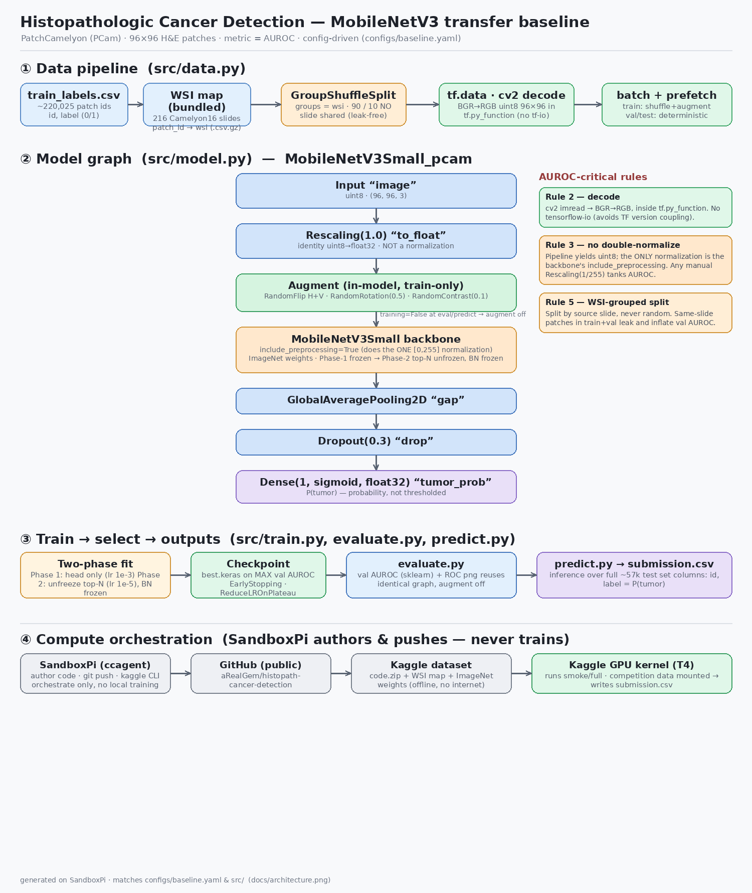

# Histopathologic Cancer Detection — MobileNetV3 transfer baseline

On-ramp entry (kanban **R09.1**). Goal: reproducible notebook + leaderboard
screenshot + one-paragraph method note. Metric: **AUROC**. The competition is in
**Late Submission** mode — it's a Knowledge/Playground comp, so it awards *no
points or medals*; the late-submission leaderboard is still your credible
"top-third" target.

Competition: https://www.kaggle.com/competitions/histopathologic-cancer-detection

## Layout

```
configs/baseline.yaml   all hyperparameters (single source of truth)
src/data.py             tf.data pipeline: split, cv2 TIFF decode, batch
src/model.py            MobileNetV3 + in-model augmentation, 2-phase freezing
src/train.py            phase-1 head train -> phase-2 fine-tune
src/evaluate.py         held-out val AUROC + ROC png
src/predict.py          test/ -> submission.csv (probabilities)
configs/smoke.yaml      ~2k-patch end-to-end sanity run
configs/sweep.yaml      hyperparameter grid (consumed by scripts/sweep.py)
scripts/download_data.sh  local/Colab data pull via Kaggle API
scripts/sweep.py        grid sweep -> artifacts/sweep_results.csv
scripts/kaggle_push.sh  push runner to Kaggle as a GPU kernel
kernel-metadata.json    Kaggle kernel spec (edit the id before pushing)
data/wsi/patch_id_wsi_full.csv.gz  bundled WSI map (leak-free grouped split)
notebooks/eda.ipynb     class balance, WSI/leakage, tiles, dtype + cv2-decode checks
notebooks/colab_kaggle_runner.ipynb  thin orchestration cell
docs/pipeline.mmd       mermaid dataflow diagram
docs/architecture.png   rendered architecture (pipeline · model graph · orchestration)
```



## Quick paths
- **EDA first:** open `notebooks/eda.ipynb` (class balance, slide/leakage stats, sample
  tiles, `96x96x3 uint8` + BGR->RGB decode verification).
- **Smoke test:** `make smoke` — trains on a 2k stratified subsample for 1+1 epochs and
  writes a real `artifacts/submission.csv`. Proves the pipeline end-to-end in minutes.
- **Sweep:** `make sweep` — grid over `configs/sweep.yaml`, results in
  `artifacts/sweep_results.csv`.
- **Kaggle GPU run:** `make kaggle-push` (after editing `kernel-metadata.json` + adding
  `~/.kaggle/kaggle.json`).

## Run it

### A) Kaggle notebook (simplest — data pre-mounted, GPU free)
1. Competition page -> **Rules** -> *I Understand and Accept* (mandatory before any submit).
2. New Notebook -> add the competition dataset -> Settings -> Accelerator = GPU.
3. In a cell: clone this repo (or paste `src/`), then:
   ```python
   !pip -q install opencv-python-headless pyyaml
   !python -m src.train   --config configs/baseline.yaml
   !python -m src.evaluate --config configs/baseline.yaml
   !python -m src.predict  --config configs/baseline.yaml
   ```
   `data.root` already defaults to `/kaggle/input/histopathologic-cancer-detection`.
4. Submit `artifacts/submission.csv` via the notebook's *Submit* button, or the CLI
   line printed by `predict.py`.

### B) Colab Pro (GPU)
1. Upload your Kaggle token to `~/.kaggle/kaggle.json`, `chmod 600` it.
2. `bash scripts/download_data.sh ./data`
3. Edit `configs/baseline.yaml` -> `data.root: ./data`.
4. `make train && make eval && make predict`

### C) Local venv (CPU ok for a smoke test, slow for full train)
```bash
python -m venv .venv && source .venv/bin/activate
# uncomment the tensorflow pin in requirements.txt first
pip install -r requirements.txt
```

## Security / hygiene (secure-by-default)
- `kaggle.json` is git-ignored and never printed. Keep it `chmod 600`.
- `opencv-python-headless` avoids desktop GUI system libs (smaller attack surface,
  no libGL headaches in containers).
- Deps are version-bounded; TF is intentionally *not* pip-installed on Colab/Kaggle
  to avoid clobbering their CUDA-matched build.
- No network calls at train/predict time beyond Kaggle download.

## Two things that move AUROC most here

1. **Slide leakage (the #1 correctness item).** Patches are cropped from a smaller
   set of whole-slide images (216 Camelyon16 slides span all 220,025 train patches).
   A naive random split puts near-duplicate patches from one slide in both train and
   val, inflating val AUROC and mis-ranking you vs. the private test set. The full
   `patch_id -> wsi` map ships **bundled and gzipped** at
   `data/wsi/patch_id_wsi_full.csv.gz`, and `data.wsi_map_csv` points at it by
   default — so `split_train_val` uses `GroupShuffleSplit(groups=wsi)` (no slide
   shared across the split) out of the box. If the map is ever absent, the pipeline
   **logs a warning and falls back** to a stratified random split (val AUROC may be
   optimistic). On Kaggle, `git clone` this repo (the map comes with it) or attach it
   as a dataset and re-point `data.wsi_map_csv`.
2. **Don't double-normalize.** The backbone is built with
   `include_preprocessing=True`, so it expects raw `[0,255]`. The pipeline yields
   `uint8`; no manual rescaling anywhere. Adding a `Rescaling(1/255)` would silently
   halve your score.

## Method note

> **MobileNetV3-Small (ImageNet) transfer baseline for PatchCamelyon.** 96×96 H&E
> patches are decoded with OpenCV (BGR→RGB, uint8) inside a `tf.py_function` and fed
> raw `[0,255]` to a `MobileNetV3Small` backbone with `include_preprocessing=True`
> (the single, in-graph normalization — no manual rescaling). In-model augmentation
> (RandomFlip H+V, RandomRotation, RandomContrast) is active only at train time, so
> eval/predict reuse the identical graph with augmentation off. Two-phase training:
> head-only (lr 1e-3) then top-40-layer fine-tune (lr 1e-5, BatchNorm frozen), with
> the checkpoint chosen on max validation AUROC. The 90/10 split is **WSI-grouped**
> (`GroupShuffleSplit` over the 216 source Camelyon16 slides) so no slide's patches
> leak across train/val — the single biggest driver of an honest val estimate here.
>
> **Results (full run, 200,026 train / 19,999 val patches, 216 slides):**
> **held-out WSI-grouped val AUROC = 0.906**; **Kaggle late-submission public LB =
> 0.9074**, private LB = 0.8763. Head-only training reached the ceiling by epoch 6
> (0.896→0.906); fine-tuning the top 40 layers at lr 1e-5 did **not** improve val
> AUROC, so EarlyStopping restored the head-only weights. The near-identical val
> (0.906) and public-LB (0.907) numbers indicate the grouped split is well
> calibrated. Reproduce: `make train && make eval && make predict` on Kaggle GPU
> with `configs/baseline.yaml`.

## Provenance
- Metric, format, late-submission status: Kaggle competition page (verified 2026-07-06).
- Dataset: modified PatchCamelyon (PCam), CC0 per Kaggle rules; label = ≥1 tumor
  pixel in the center 32×32 region of each 96×96 patch.
